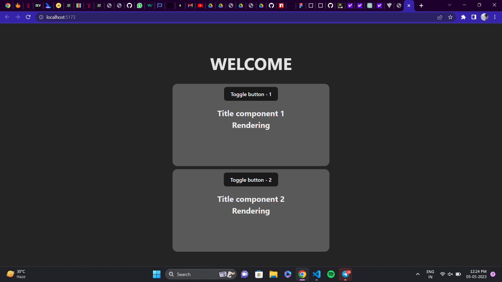

# Toggle-component

  ```md
    
    ```

#This Project contain a couple of toggle buttons which can be used to toggle respective component. 
#Both the toggle buttons and components work irrespective of the other button and components.
#There is also a setInterval function which works only if the toggle is true. 
